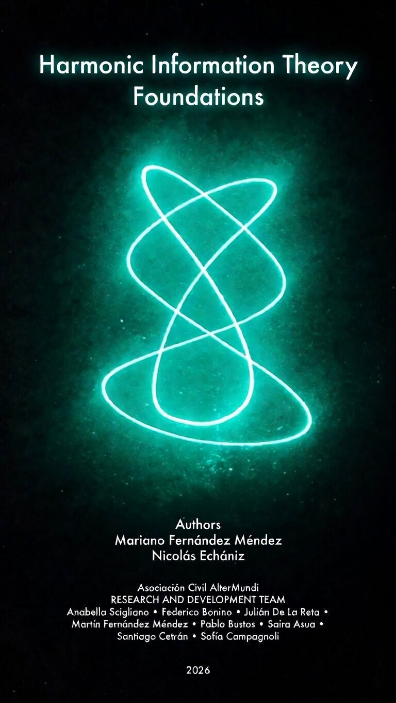

  

<h1 align="center">Harmonic Information Theory Foundations</h1>

  <strong>Mariano Fernández Méndez &amp; Nicolás Echaniz</strong> 
  <em>Asociación Civil AlterMundi</em>

  
  
  
  

---

## 📖 About the Book

A transdisciplinary investigation into whether proportional relationships between frequencies constitute a fundamental level of information organization — prior to any absolute frequency.

> *"In the beginning, there was one thing. So the thing stretched. And as it stretched, it wiggled. And when it wiggled, it understood it was one no more, because there was it and the wiggle. So she wiggled more..."*
>
> — Nicolás Echaniz

**Structure:** 6 parts · 16 chapters · 22 formal concepts · 6 hypotheses · 3 probes · 7 domains

---

## ⬇️ Download

| Format | Description | Link |
|--------|-------------|------|
| **📄 PDF** | Official preliminary edition with full typographic design. The ISBN, when assigned, will correspond exclusively to this format. | [**Download PDF**](https://hit.altermundi.net/libro/Harmonic_Information_Theory_Foundations_AlterMundi.pdf) |
| **📝 Markdown** | Structured text version optimized for automated reading and semantic navigation by LLMs. | [**Download Markdown**](https://hit.altermundi.net/libro/Harmonic_Information_Theory_Foundations_AlterMundi_for-Ai-agents.md) |
| **📦 LaTeX** | Full editorial source code of the book. | [Browse source](https://github.com/AlterMundi/harmonic-information-theory) |

---

## 🔬 Research Hypotheses

| # | Hypothesis |
|---|-----------|
| **H1** | Harmonic structures exist in real-world signals |
| **H2** | They are computationally learnable by ML |
| **H3** | They are cross-modal (light, sound, movement, etc.) |
| **H4** | They are biologically significant |
| **H5** | They have affective correlates in humans |
| **H6** | They structure symbolic representations (language, mathematics, art) |

---

## 🛰️ Research Ecosystem

### [Harmonic Beacon](https://harmonicbeacon.com) · *Artefact*
The experiential probe of HIT. A continuously excited string holds open the full natural harmonic series as a living acoustic field. Available as a 24/7 live stream.

### [Phideus](https://phideus.net) · *Research Instrument*
An AI research program testing whether harmonic frequency ratios transfer across sensory modalities using contrastive cross-modal learning (VICReg). 84.1% reference performance in musical validations.

---

## 👥 Authors

**Mariano Fernández Méndez** — Researcher, writer, and developer. Responsible for the final compilation, writing, and conceptual architecture of this work.  
📧 mariano@altermundi.net

**Nicolás Echaniz** — Co-founder of AlterMundi, musician, and researcher in natural harmony. Leads the conceptual and technical direction of HIT and created the Harmonic Beacon.  
📧 nicoechaniz@altermundi.net

---

## 🛠️ Research & Development Team

| Name | Role |
|------|------|
| **Anabella Scigliano** | Biomedical engineering student. Physiological and biomedical perspective, harmonic structures & neurological processes. |
| **Federico Bonino** | Electronics technician and sound recording operator. Electronics, signal acquisition, and acoustic processing. |
| **Julián De La Reta** | Jungian-oriented psychologist. Personal myth projection, symbolic interpretation, and experiential dimension. |
| **Martín Fernández Méndez** | Industrial designer and university lecturer. Industrial design, mechatronics, optics, and experimental devices. |
| **Pablo Bustos** | Developer. Software, electronics, mechatronics, optics, and radiofrequency systems. |
| **Saira Asua** | Vibe coding. Administration, organization, web hosting, and technical follow-up. |
| **Santiago Cetrán** | Developer. QA, monitoring, validation scripts, and technical support. |
| **Sofía Campagnoli** | Industrial design student (UP) and teaching assistant. Design support, devices, and materials. |

---

## 📜 License

This work is licensed under [**Creative Commons Attribution 4.0 International (CC BY 4.0)**](https://creativecommons.org/licenses/by/4.0/).

You are free to share, copy, redistribute, adapt, and remix — even for commercial purposes — as long as appropriate credit is given.

---

## 🔗 Links

- 🌐 **Website:** [hit.altermundi.net](https://hit.altermundi.net)
- 📚 **Book source (LaTeX):** [AlterMundi/harmonic-information-theory](https://github.com/AlterMundi/harmonic-information-theory)
- 🤖 **Phideus:** [AlterMundi/Phideus](https://github.com/AlterMundi/Phideus)
- 🔊 **Beacon:** [harmonicbeacon.com](https://harmonicbeacon.com)
- 📖 **DeepWiki:** [deepwiki.com/AlterMundi/harmonic-information-theory](https://deepwiki.com/AlterMundi/harmonic-information-theory)
- 📧 **Contact:** [editorial@altermundi.net](mailto:editorial@altermundi.net)

---

  <em>Asociación Civil AlterMundi · 2025</em>

